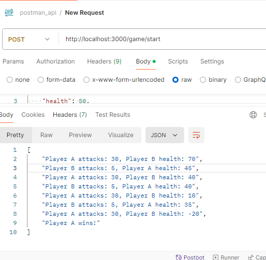

# magical-arena_Game_NodeJS

### Installation

1. Clone the repository
    `git clone <repository-url>`

2. Install the dependencies
    `npm install`

### Running the Application

To start the server, run:
`npm start`

output:->
postman collection JSON data:

{
  "playerA": {
    "health": 50,
    "strength": 5,
    "attack": 10
  },
  "playerB": {
    "health": 100,
    "strength": 10,
    "attack": 5
  }
}

